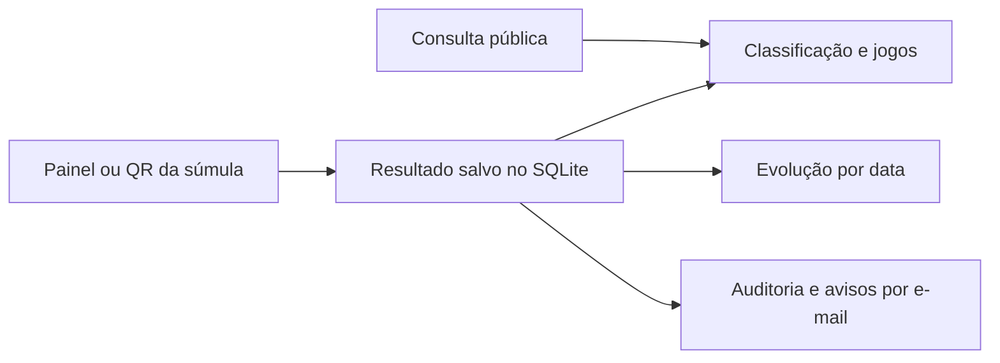

# ⚽ Copa Lago de Pedra

**Classificação, jogos e súmulas de futebol de botão — em um site pensado para o celular.**


Sistema da I Copa Lago de Pedra, desenvolvido por **Júlio César Valera**. A versão PHP reúne consulta pública, registro de resultados, súmulas com QR Code, contas de usuários e auditoria. Não exige Node.js, Composer ou um servidor MySQL.

> Este repositório contém código e uma demonstração com nomes fictícios. Não contém o banco da competição, resultados reais, contas de usuários, senhas ou configurações da hospedagem.

## 🧭 Por onde começar

- **Quero testar:** siga [Executar no computador](#-executar-no-computador).
- **Quero hospedar:** veja [Publicação](#-publicação).
- **Quero aprender a usar:** abra o **Guia de uso** pelo link no site ou painel.
- **Quero desenvolver:** consulte [Estrutura](#-estrutura) e [Testes](#-testes).
- **Quero ver o que mudou:** leia o [histórico de versões](CHANGELOG.md).

## ✨ O que o sistema faz

| Recurso | Como ajuda |
| --- | --- |
| Classificação automática | Vitória vale 3 pontos e empate vale 1. Critérios: pontos, vitórias, saldo de gols e gols marcados. |
| Tabela de jogos | Filtros por botonista, rodada e situação; favoritos ficam no próprio dispositivo, vinculados ao identificador do jogador para resistir a correções de nome. |
| Evolução | Gráfico e tabela de posições e pontos ao final de cada data com jogos. |
| Súmula imprimível | Permite escolher a data da partida e gerar um QR para registrar o resultado nessa data. |
| Contas e permissões | Botonistas cuidam de seus jogos; administradores têm responsabilidades distintas. |
| E-mails | Convites, avisos de resultados aos jogadores e cópias configuráveis ao organizador. |
| Auditoria | Histórico das alterações, autoria, dados anteriores e novos; controle de falhas de e-mail. |
| Acessibilidade | Layout responsivo, aumento de fonte, contraste, navegação por teclado e guia em linguagem simples. |



## 🛠 Requisitos

- PHP **8.2 ou superior**, com **PDO SQLite**, **SQLite3** e **OpenSSL** habilitados.
- Permissão de escrita na pasta `painel_php/data/` para o processo do PHP.
- Serviço SMTP para enviar convites e notificações.
- Navegador atualizado. O front-end usa HTML, CSS e JavaScript sem etapa de compilação.

Confira as extensões com `php -m`. Configure certificados confiáveis no PHP para conexões SMTP com TLS; não desative a verificação de certificados.

## 🚀 Executar no computador

### 1. Baixe o código

```bash
git clone https://github.com/juliovalera/copa-lago-de-pedra.git
cd copa-lago-de-pedra
```

### 2. Crie sua configuração privada

Copie `painel_php/config.example.php` para `painel_php/config.php`. No PowerShell:

```powershell
Copy-Item painel_php/config.example.php painel_php/config.php
$env:COPA_ADMIN_PASSWORD = "SUBSTITUA-POR-UMA-SENHA-FORTE-E-EXCLUSIVA"
$env:COPA_BASE_URL = "http://localhost:8080"
```

No Linux/macOS, use `cp` para copiar o arquivo e `export COPA_ADMIN_PASSWORD='sua-senha'` para definir a variável. Também é possível preencher os valores diretamente no `config.php`, que está excluído do Git.

**Não utilize o texto de exemplo como senha real.** Sem uma senha configurada, o acesso principal não é liberado.

### 3. Crie uma demonstração opcional

Em uma instalação nova e vazia:

```bash
php painel_php/seed-demo.php --demo
```

Esse comando cria **26 botonistas fictícios e 650 jogos**, em turno e returno. Não cria usuários, resultados nem envia e-mails. Recusa a execução se encontrar jogadores, jogos, usuários ou auditoria no banco. Não execute em produção.

### 4. Inicie o site

```bash
php -S localhost:8080 -t painel_php/public
```

| Endereço local | Tela |
| --- | --- |
| `http://localhost:8080/` | Consulta pública |
| `http://localhost:8080/admin.php` | Painel |
| `http://localhost:8080/guia.php` | Guia de uso |

No primeiro acesso ao painel, **deixe “Login ou e-mail” vazio** e informe a senha principal que configurou. Depois, use **Usuários** para cadastrar contas e enviar convites.

> A pasta `site/` fornece os recursos visuais usados pelo PHP. Abrir `site/index.html` diretamente não substitui o site PHP; os dados são fornecidos por `painel_php/public/data.php`.

## 👥 Quem pode fazer o quê?

| Perfil | Acesso |
| --- | --- |
| Visitante | Consulta classificação, jogos, evolução e guia. |
| Botonista | Registra resultados e gera súmulas dos jogos vinculados; corrige seu nome. |
| Administrador | Gerencia resultados e nomes, consulta auditoria permitida e cria/baixa backups. |
| Administrador máximo | Usa a senha principal da configuração; gerencia usuários, privilégios, restauração, reenvio de avisos e logs de autenticação. |

Cinco tentativas incorretas em 15 minutos causam bloqueio temporário de 15 minutos para a combinação de conta e IP. Desativar uma conta cancela seus convites pendentes.

## 📧 Configurar os e-mails

Preencha o bloco `smtp` do arquivo privado ou use estas variáveis:

| Variável | Exemplo ou finalidade |
| --- | --- |
| `COPA_SMTP_HOST` | Servidor do seu provedor |
| `COPA_SMTP_PORT` | `587` para STARTTLS, ou `465` para SSL |
| `COPA_SMTP_ENCRYPTION` | `tls` ou `ssl` |
| `COPA_SMTP_USERNAME` | Usuário SMTP |
| `COPA_SMTP_PASSWORD` | Senha SMTP |
| `COPA_SMTP_FROM_EMAIL` | Remetente autorizado pelo provedor |
| `COPA_SMTP_FROM_NAME` | Nome que aparece como remetente |
| `COPA_NOTIFY_EMAIL` | Destinatário das cópias ao organizador; opcional |

Os avisos aos jogadores usam o e-mail da conta vinculada a cada participante. Desde a versão 1.38, o campo `users.role` separa permissão de acesso de `users.player_id`: um administrador também pode ser vinculado ao seu botonista sem perder acesso aos demais jogos. A migração preserva os níveis existentes; o acesso principal escolhe explicitamente os novos vínculos em **Usuários → Alterar privilégios**. A organização também recebe avisos de ações administrativas, no endereço configurado. Um mesmo destinatário recebe apenas uma mensagem por evento. A Auditoria apresenta endereço, status e tentativas de cada envio, sem garantir entrega na caixa de entrada. Gerar ou reemitir uma súmula também avisa os dois jogadores, com confronto e data, sem divulgar o token do QR. Resultados novos, corrigidos ou removidos geram avisos; salvar sem mudança não gera outro envio. Falhas de SMTP não desfazem o resultado e podem ser tratadas na Auditoria pelo administrador máximo. Os avisos são enviados logo após salvar, com o SMTP configurado, sem precisar de tarefas agendadas. Se o envio falhar, o administrador máximo pode tentar novamente pela Auditoria. A resposta pode demorar enquanto o servidor de e-mail é consultado.

**Atualização de instalações anteriores:** configure `notification_email` no `config.php` ou `COPA_NOTIFY_EMAIL` para manter as cópias ao organizador. O endereço deixou de ficar fixo no código. Sem esse valor, apenas as cópias ao organizador ficam desativadas.

### Avisos de alteração de cadastro

O titular recebe aviso ao alterar nome, e-mail ou definir/redefinir senha pelo convite. O administrador máximo edita nome e e-mail em **Usuários**. A troca de e-mail avisa o endereço antigo e o novo e cancela convites antigos. Correções do nome do botonista também avisam as contas vinculadas. Senhas e tokens não aparecem nos avisos.

## 🌐 Publicação

1. Faça backup dos dados e da configuração da instalação existente.
2. Envie o código mantendo `painel_php/` e `site/` como pastas irmãs.
3. Configure a raiz pública do servidor para **`painel_php/public/`**. Os recursos de `site/` são servidos por uma lista permitida em `asset.php`.
4. Crie o `config.php` privado e configure a senha, SMTP, diretório do banco e `base_url` com o endereço HTTPS completo, incluindo o subdiretório quando houver.
5. Permita escrita apenas onde necessário para o banco e backups. Em hospedagens usuais, arquivos de código usam `0644` e diretórios `0755`; as pastas de dados dependem do usuário do servidor. Não utilize `0777` como solução padrão.
6. Abra o site e confira login, classificação e e-mails com contas de teste.

**Atualizações:** substitua o código preservando `config.php` e `data/`. As mudanças de estrutura do SQLite são aplicadas pela aplicação ao inicializar. Nunca sobrescreva o banco de produção com a demonstração.

Se a hospedagem não permitir definir a raiz pública, configure regras específicas para negar acesso HTTP a configurações, bancos, backups, testes e scripts privados. O `.htaccess` de `data/` protege esse diretório no Apache quando permitido; Nginx exige configuração equivalente.

GitHub armazena o código. **GitHub Pages não executa PHP nem SQLite**: utilize hospedagem com suporte a PHP para o sistema funcionar.

## 🧩 Estrutura

```text
painel_php/
├── config.example.php    # Modelo sem credenciais
├── db.php                # Banco, migrações, classificação e evolução
├── audit.php             # Operações auditadas
├── notifications.php     # Fila e envio de avisos
├── login_security.php    # Proteção de autenticação
├── seed-demo.php         # Demonstração fictícia, apenas via terminal
├── version.php           # Versão e créditos
├── public/               # Única raiz pública do servidor
├── tests/                # Testes com dados isolados
└── data/                 # Banco e backups privados, fora do Git
site/                     # HTML, CSS, JavaScript e identidade visual
scripts/check_publication.py # Conferência dos arquivos preparados no Git
```

## ✅ Testes

Com PHP e as extensões configurados, a partir da raiz:

```bash
php painel_php/tests/run.php
php painel_php/tests/queue_and_dates.php
php painel_php/tests/history.php
php painel_php/tests/notifications.php
php painel_php/tests/match_notifications.php
php painel_php/tests/audit.php
php painel_php/tests/login_security.php
```

Crie antes o `config.php` a partir do exemplo. Esses testes usam bancos em memória/temporários; os testes de notificações simulam SMTP e não enviam e-mails reais. Não use bancos da competição para testar.

O teste HTTP completo requer também Python 3:

```bash
python painel_php/tests/audit_http.py
```

Ele monta uma aplicação temporária e gera prévias fictícias em `previews/`, excluídas do Git. Não depende das planilhas originais.

## 🔒 Dados e limites conhecidos

- `.gitignore` usa uma lista de inclusão para impedir publicação acidental de bancos, configurações, planilhas, resultados, ZIPs e prévias.
- Execute `python scripts/check_publication.py` depois de preparar os arquivos com `git add`. A verificação ajuda, mas não substitui a revisão do conteúdo.
- O QR da súmula é gerado no navegador por uma biblioteca local, sem enviar o link a serviços externos. O JavaScript deve estar habilitado para gerar o QR; o botão de impressão aguarda sua geração. O portador do QR pode enviar o resultado na data escolhida e uma única vez.
- O histórico representa os resultados atualmente registrados por data; corrigir um placar recalcula a evolução. A auditoria guarda as alterações.
- A demonstração e a validação de restauração de backup seguem o formato de 26 participantes e 650 jogos. Adaptar para outro campeonato exige revisar essas regras e os textos.

## 👨‍🏫 Autoria e licença

**Júlio César Valera** — Professor de Matemática, Programação e Robótica da rede pública de ensino do Estado de São Paulo.

Contato público: **julio@projetos.tec.br**.

Código e documentação distribuídos sob a [licença MIT](LICENSE). Preserve o aviso de autoria ao redistribuir. A licença do software não concede direitos sobre marcas e logotipos da Copa Lago de Pedra ou da Liga Mogiana; consulte seus titulares antes de reutilizá-los em outra identidade visual.

A geração local de QR usa [QR Code Generator, de Kazuhiko Arase](painel_php/public/vendor/qrcode-generator/README.md), com sua licença MIT preservada.

### Proteção contra edições simultâneas

Desde a versão 1.40, o painel verifica a revisão do jogo antes de salvar placar, data ou remoção. Se outro acesso ou QR atualizou o resultado, o formulário antigo é recusado e o usuário deve conferir os dados atuais antes de tentar novamente. A migração adiciona `games.result_revision`; mudanças reais incrementam a revisão dentro da mesma transação. Conflitos não geram aviso de resultado nem alteram a classificação.

### Súmula digital (1.41)

A geração oferece impressão com QR ou preenchimento no celular. O QR também abre a ficha digital na data da partida. O rascunho guarda campos; a finalização exige gols dos dois tempos, horário, nome do árbitro, concordância e três assinaturas desenhadas. Alterar dados limpa as assinaturas no navegador.

Os traços são validados no servidor e guardados em `digital_sheets`, no próprio SQLite. Não há upload de imagens, serviço externo ou agendamento. O salvamento exige internet. Ficha final, placar, consumo dos QR e auditoria são gravados atomicamente; avisos do resultado seguem após o commit. Controle de revisão impede sobrescrita de rascunhos e resultados.

Documentos finalizados são imutáveis. Correções administrativas do placar preservam o original. Administradores e contas dos participantes consultam as fichas no painel; o portador do QR recebe acesso ao comprovante na sessão em que finalizou. As assinaturas não são publicadas nem incluídas nos e-mails ou logs. O desenho registra concordância, sem autenticar a identidade do signatário.

O botão de PDF usa a impressão nativa do navegador (opção Salvar como PDF do dispositivo). Os backups SQLite incluem as fichas e a restauração mantém documentos atuais, importando os ausentes sem substituir originais. Não existe editor de fichas assinadas.

Teste isolado: `php painel_php/tests/digital_sheets.php`; os testes HTTP também cobrem a escolha dos formatos, CSRF, acesso privado e finalização.

O teste `painel_php/tests/run.php` funciona somente pela linha de comando e prepara sua própria configuração temporária, banco em memória e dados fictícios. Não carrega o `config.php` da instalação e não envia e-mails. As cópias automáticas anteriores à restauração podem ser baixadas no painel, assim como os backups comuns.
